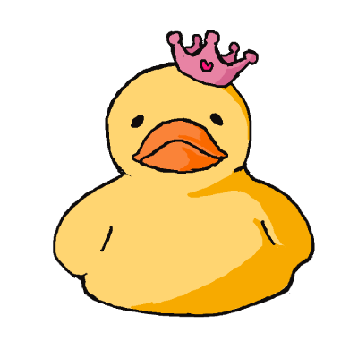

# Rubber Duck

ITP Dynamic Web Development 2024 Spring, Assignment #1.

## About

This is a simple practice website. Idea is based on the debugging method: talking to a rubber duck.
The crown wiggles when mouse hover on the duck.

## Setup

**Using VS Code:**
1. Download all files in a folder.
2. Open the folder in VS Code.
3. Make sure to install Live Server or Live Preview in Extentions
4. Run command "Live Server: Open with Live Server" or "Live Preview: Start Server" to view.

**Through git & Terminal:**
1. In Terminal, `cd` to desired directory location.
2. Clone this repo to local `git clone https://github.com/lqiuuu/rubber-duck.git .`
3. Start local server `python3 -m http.server` or `python -m SimpleHTTPServer`, or similar command based on environment.
4. Go to the returned http address in browser.
5. `control + c` to stop the server.

**View Live Site:**
Visit [Glitch](https://rustic-onyx-gasoline.glitch.me/)

<!-- Write instructions on how to start working on your project -->
### Develop

This project is controled by local git.
Images are drawn in Procreate, and modified in Adobe Illustrator.
Code is written in VS Code.
Remote origin to this repo added through Terminal on Mac.
git updates are commited and pushed to this remote repo on GitHub through GitHub Desktop.

### Deployment

This project is hosted on Glitch.
* [Live Site](https://rustic-onyx-gasoline.glitch.me/) 

## Notes & Documentation & Questions
[ITP blog](https://lejingqiu.notion.site/Assignment-1-869cc8bcfe574cb6bf000a70aa5bd42c?pvs=4)
the blog post contains:
* commands used in Terminal
* problems encountered
* references

## Author

* [Lejing Qiu](https://lejingqiu.com) -- First Year -- [NYU ITP](https://itp.nyu.edu)

***
***
***

